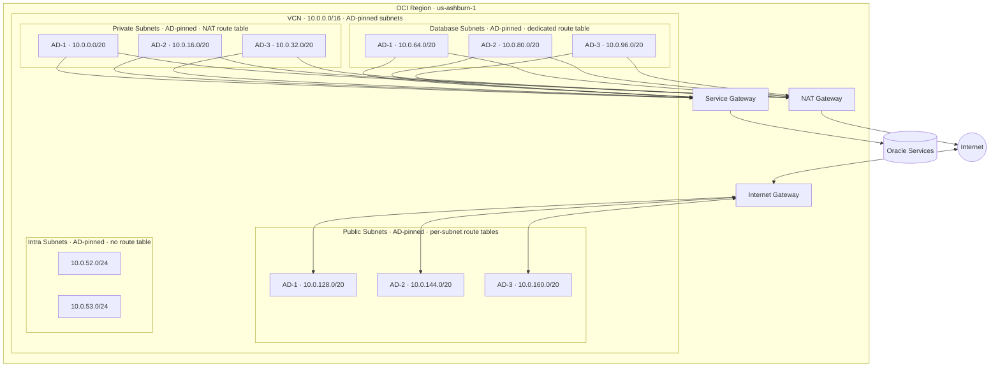

# Complete VCN

Configuration in this directory creates a comprehensive set of VCN resources suitable for a staging or production environment (see [simple](../simple) for a minimal setup).

There are public, private, database, and intra (fully isolated, no outbound route) subnets, all pinned to specific availability domains. A single NAT Gateway, an Internet Gateway, and a Service Gateway are created. Flow logs are enabled for all subnet types, and the database subnets get a dedicated route table.

[Read more about OCI VCN, subnets, and availability domains](https://docs.oracle.com/en-us/iaas/Content/Network/Tasks/Overview_of_VCNs_and_Subnets.htm).

## Architecture



## Usage

To run this example you need to execute:

```bash
$ terraform init
$ terraform plan
$ terraform apply
```

Note that this example may create resources which can cost money (NAT Gateway, flow log storage, for example). Run `terraform destroy` when you don't need these resources.

<!-- BEGIN_TF_DOCS -->
## Requirements

| Name | Version |
|------|---------|
| <a name="requirement_terraform"></a> [terraform](#requirement\_terraform) | >= 1.5 |
| <a name="requirement_oci"></a> [oci](#requirement\_oci) | >= 5.0 |

## Providers

No providers.

## Modules

| Name | Source | Version |
|------|--------|---------|
| <a name="module_vcn"></a> [vcn](#module\_vcn) | ../../ | n/a |

## Resources

No resources.

## Inputs

| Name | Description | Type | Default | Required |
|------|-------------|------|---------|:--------:|
| <a name="input_compartment_id"></a> [compartment\_id](#input\_compartment\_id) | The OCID of the compartment where resources will be created | `string` | n/a | yes |

## Outputs

| Name | Description |
|------|-------------|
| <a name="output_ad_names"></a> [ad\_names](#output\_ad\_names) | Resolved availability domain names |
| <a name="output_ads"></a> [ads](#output\_ads) | AD numbers specified as input |
| <a name="output_database_route_table_ids"></a> [database\_route\_table\_ids](#output\_database\_route\_table\_ids) | List of OCIDs of the dedicated database route tables |
| <a name="output_database_subnets"></a> [database\_subnets](#output\_database\_subnets) | List of OCIDs of database subnets |
| <a name="output_database_subnets_cidr_blocks"></a> [database\_subnets\_cidr\_blocks](#output\_database\_subnets\_cidr\_blocks) | List of CIDR blocks of database subnets |
| <a name="output_default_dhcp_options_id"></a> [default\_dhcp\_options\_id](#output\_default\_dhcp\_options\_id) | The OCID of the VCN default DHCP options |
| <a name="output_default_route_table_id"></a> [default\_route\_table\_id](#output\_default\_route\_table\_id) | The OCID of the VCN default route table |
| <a name="output_default_security_list_id"></a> [default\_security\_list\_id](#output\_default\_security\_list\_id) | The OCID of the VCN default security list |
| <a name="output_flow_log_group_ids"></a> [flow\_log\_group\_ids](#output\_flow\_log\_group\_ids) | Map of subnet type to flow log group OCID |
| <a name="output_flow_log_ids"></a> [flow\_log\_ids](#output\_flow\_log\_ids) | Map of subnet key to flow log OCID |
| <a name="output_internet_gateway_id"></a> [internet\_gateway\_id](#output\_internet\_gateway\_id) | The OCID of the Internet Gateway |
| <a name="output_intra_route_table_id"></a> [intra\_route\_table\_id](#output\_intra\_route\_table\_id) | The OCID of the intra (isolated) route table |
| <a name="output_intra_subnets"></a> [intra\_subnets](#output\_intra\_subnets) | List of OCIDs of intra subnets |
| <a name="output_intra_subnets_cidr_blocks"></a> [intra\_subnets\_cidr\_blocks](#output\_intra\_subnets\_cidr\_blocks) | List of CIDR blocks of intra subnets |
| <a name="output_nat_ids"></a> [nat\_ids](#output\_nat\_ids) | List of OCIDs of NAT Gateways |
| <a name="output_nat_public_ips"></a> [nat\_public\_ips](#output\_nat\_public\_ips) | List of public IP addresses of NAT Gateways |
| <a name="output_private_route_table_ids"></a> [private\_route\_table\_ids](#output\_private\_route\_table\_ids) | List of OCIDs of NAT Gateway route tables |
| <a name="output_private_subnets"></a> [private\_subnets](#output\_private\_subnets) | List of OCIDs of private subnets |
| <a name="output_private_subnets_cidr_blocks"></a> [private\_subnets\_cidr\_blocks](#output\_private\_subnets\_cidr\_blocks) | List of CIDR blocks of private subnets |
| <a name="output_public_route_table_id"></a> [public\_route\_table\_id](#output\_public\_route\_table\_id) | The OCID of the Internet Gateway route table |
| <a name="output_public_subnets"></a> [public\_subnets](#output\_public\_subnets) | List of OCIDs of public subnets |
| <a name="output_public_subnets_cidr_blocks"></a> [public\_subnets\_cidr\_blocks](#output\_public\_subnets\_cidr\_blocks) | List of CIDR blocks of public subnets |
| <a name="output_service_gateway_id"></a> [service\_gateway\_id](#output\_service\_gateway\_id) | The OCID of the Service Gateway |
| <a name="output_vcn_cidr_block"></a> [vcn\_cidr\_block](#output\_vcn\_cidr\_block) | The primary CIDR block of the VCN |
| <a name="output_vcn_cidr_blocks"></a> [vcn\_cidr\_blocks](#output\_vcn\_cidr\_blocks) | All CIDR blocks (primary + secondary) of the VCN |
| <a name="output_vcn_dns_label"></a> [vcn\_dns\_label](#output\_vcn\_dns\_label) | The DNS label of the VCN |
| <a name="output_vcn_id"></a> [vcn\_id](#output\_vcn\_id) | The OCID of the VCN |
<!-- END_TF_DOCS -->
