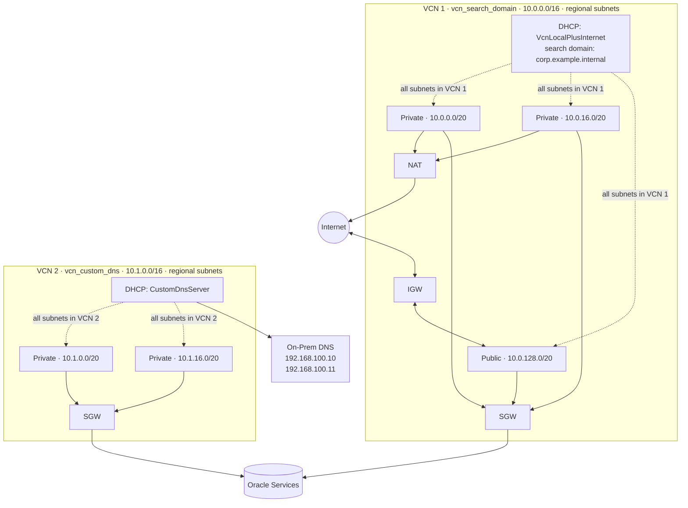

# DHCP Options

Configuration in this directory demonstrates using the module's `enable_dhcp_options` flag to override the OCI-default DHCP options set that every VCN receives at creation time.

Two VCNs are created side-by-side to show both supported DNS server types:

| VCN                 | `dhcp_options_server_type` | Purpose                                                                        |
| ------------------- | -------------------------- | ------------------------------------------------------------------------------ |
| `vcn_search_domain` | `VcnLocalPlusInternet`     | OCI's built-in VCN resolver + a custom search domain (`corp.example.internal`) |
| `vcn_custom_dns`    | `CustomDnsServer`          | All DNS queries forwarded to on-premises DNS servers                           |

**When `enable_dhcp_options = false` (the default)**, every subnet inherits OCI's VCN-default DHCP options, which use `VcnLocalPlusInternet` with no custom search domain. This covers most use-cases.

**When `enable_dhcp_options = true`**, the module creates an `oci_core_dhcp_options` resource and associates it with all subnets, overriding the VCN default.

**OCI DHCP server types:**

- `VcnLocalPlusInternet` — uses OCI's built-in VCN resolver, which handles DNS for resources within the VCN and forwards public names to the internet. This is equivalent to `AmazonProvidedDNS` in AWS. Combined with `dhcp_options_domain_name`, unqualified hostnames (e.g. `db01`) are resolved as fully-qualified names (e.g. `db01.corp.example.internal`).

- `CustomDnsServer` — bypasses OCI's resolver entirely. All DNS queries are sent to the IP addresses listed in `dhcp_options_domain_name_servers`. Use this when instances must resolve names from an on-premises or custom DNS infrastructure.

Subnets in both VCNs are **regional** (`ads` not set) — each spans all availability domains automatically.

[Read more about OCI DHCP Options](https://docs.oracle.com/en-us/iaas/Content/Network/Tasks/managingDHCP.htm).

## Architecture



## Usage

To run this example you need to execute:

```bash
$ terraform init
$ terraform plan
$ terraform apply
```

Note that this example may create resources which can cost money (NAT Gateway, Service Gateways). Run `terraform destroy` when you don't need these resources.

<!-- BEGIN_TF_DOCS -->
## Requirements

| Name | Version |
|------|---------|
| <a name="requirement_terraform"></a> [terraform](#requirement\_terraform) | >= 1.5 |
| <a name="requirement_oci"></a> [oci](#requirement\_oci) | >= 5.0 |

## Providers

No providers.

## Modules

| Name | Source | Version |
|------|--------|---------|
| <a name="module_vcn_custom_dns"></a> [vcn\_custom\_dns](#module\_vcn\_custom\_dns) | ../../ | n/a |
| <a name="module_vcn_search_domain"></a> [vcn\_search\_domain](#module\_vcn\_search\_domain) | ../../ | n/a |

## Resources

No resources.

## Inputs

| Name | Description | Type | Default | Required |
|------|-------------|------|---------|:--------:|
| <a name="input_compartment_id"></a> [compartment\_id](#input\_compartment\_id) | The OCID of the compartment where resources will be created | `string` | n/a | yes |

## Outputs

| Name | Description |
|------|-------------|
| <a name="output_custom_dns_default_dhcp_options_id"></a> [custom\_dns\_default\_dhcp\_options\_id](#output\_custom\_dns\_default\_dhcp\_options\_id) | The OCID of the VCN-default DHCP options set (not the managed custom set) |
| <a name="output_custom_dns_dhcp_options_id"></a> [custom\_dns\_dhcp\_options\_id](#output\_custom\_dns\_dhcp\_options\_id) | The OCID of the custom DHCP options set (CustomDnsServer) |
| <a name="output_custom_dns_private_subnets"></a> [custom\_dns\_private\_subnets](#output\_custom\_dns\_private\_subnets) | List of OCIDs of private subnets in the custom-DNS VCN |
| <a name="output_custom_dns_vcn_cidr_block"></a> [custom\_dns\_vcn\_cidr\_block](#output\_custom\_dns\_vcn\_cidr\_block) | The primary CIDR block of the custom-DNS VCN |
| <a name="output_custom_dns_vcn_id"></a> [custom\_dns\_vcn\_id](#output\_custom\_dns\_vcn\_id) | The OCID of the VCN using custom DNS forwarders |
| <a name="output_search_domain_default_dhcp_options_id"></a> [search\_domain\_default\_dhcp\_options\_id](#output\_search\_domain\_default\_dhcp\_options\_id) | The OCID of the VCN-default DHCP options set (not the managed custom set) |
| <a name="output_search_domain_dhcp_options_id"></a> [search\_domain\_dhcp\_options\_id](#output\_search\_domain\_dhcp\_options\_id) | The OCID of the custom DHCP options set (VcnLocalPlusInternet + search domain) |
| <a name="output_search_domain_private_subnets"></a> [search\_domain\_private\_subnets](#output\_search\_domain\_private\_subnets) | List of OCIDs of private subnets in the search-domain VCN |
| <a name="output_search_domain_public_subnets"></a> [search\_domain\_public\_subnets](#output\_search\_domain\_public\_subnets) | List of OCIDs of public subnets in the search-domain VCN |
| <a name="output_search_domain_vcn_cidr_block"></a> [search\_domain\_vcn\_cidr\_block](#output\_search\_domain\_vcn\_cidr\_block) | The primary CIDR block of the search-domain VCN |
| <a name="output_search_domain_vcn_id"></a> [search\_domain\_vcn\_id](#output\_search\_domain\_vcn\_id) | The OCID of the VCN using OCI resolver with a custom search domain |
<!-- END_TF_DOCS -->
